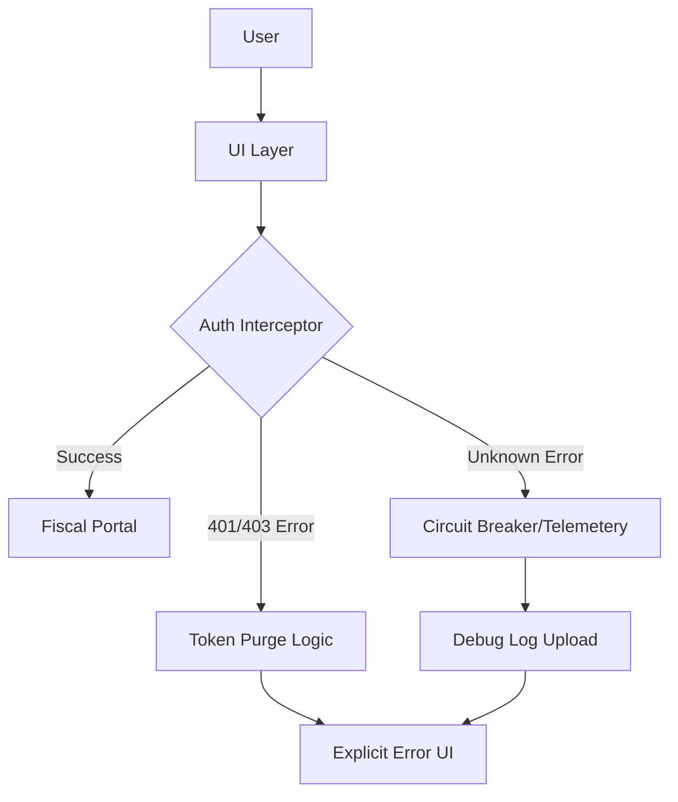

# POS-API - Requirements Document

## Iteration 7

## Project Description
Project Name: POS-API

Project Summary
POS-API is a fiscal management solution designed to generate, register, and synchronize Value Added Tax (VAT) receipts directly with the central tax authority's database. This system serves as a compliant bridge between a business's sales operations and government requirements, ensuring that every transaction issues a valid lottery code and QR receipt in real-time.

Key Features
- Real-time generation of unique fiscal QR codes and lottery numbers for valid tax compliance.
- A robust RESTful API allowing seamless integration with existing ERP systems, online stores, or third-party POS hardware.
- A web-based administrative dashboard for manual receipt entry, voiding erroneous transactions, and viewing sales history.
- Offline synchronization capabilities to queue transactions during internet outages and process them once connectivity is restored.

Target Users
Small to medium-sized retail business owners, cashiers requiring manual entry tools, and software developers integrating fiscal reporting into custom applications.

Core User Flows
1. Automated API Request: An external POS system sends a transaction request containing items and prices; POS-API validates the data, registers it with the tax authority, and returns the printable receipt data and QR image.
2. Manual Entry: A user logs into the web portal, inputs the total transaction amount, and clicks "Generate" to print a receipt via a connected thermal printer.
3. Reporting: An administrator accesses the dashboard to export daily sales reports and verify VAT submission status.

## Customer Persona
- **Name**: Elena Sokolova
- **Role**: Director of Operations and Compliance
- **Goals**: Automate fiscal reporting to eliminate manual entry errors and government fines; Provide a standardized API that third-party vendors and partners can easily integrate into their existing hardware; Ensure 100% transaction compliance even during frequent local internet outages

## Target Users
- **Marco Rossi** (Primary User (Manual Entry)): Generate a valid fiscal receipt in under 10 seconds
- **Arjun Mehta** (Technical Integration User): Automate receipt generation via API to eliminate manual entry by staff
- **Sofia Petrov** (Administrative/Secondary User): Reconcile daily sales totals with the tax authority records

## Key User Stories (Must-Have)
- API Transaction Registration
- API Authentication & Security
- Manual Receipt Entry
- Thermal Printing Integration
- Daily VAT Reconciliation Report

## User Feedback Incorporated
need a fully functional application

## Refined Requirements
# Technical Specification: POS-API Fiscal Management Solution (Iteration 7)

## 1. Executive Summary
**Project Name:** POS-API  
**Version:** 1.7.0  
**Status:** Root Cause Resolution & Recovery (Iteration 7)  
**Core Objective:** To break the "Unknown Issue" authentication loop that has caused 5+ consecutive system failures. This iteration shifts from general stabilization to **Aggressive Debugging and Auth Flow Reconstruction**. The goal is to deliver a "fully functional" login-to-dashboard experience for the Merchant Fiscal Portal by eliminating silent failures and implementing transparent error handling.

---

## 2. Problem Statement
*   **User Feedback:** "Need a fully functional application." Currently, the app is unusable due to an authentication bottleneck.
*   **The "Unknown Issue" Loop:** System telemetry indicates a recursive failure in the authentication handshake. UI tests are failing consistently (5+ times), triggering circuit breakers.
*   **Root Cause Hypothesis:** Likely a mismatch between the Auth token persistence layer and the API gateway middleware, leading to a "Redirect-to-Login-on-Success" loop or a silent 401/403 error handled poorly by the UI.

---

## 3. Prioritized Requirements (Iteration 7)

### P0: Authentication Reconstruction (The "Kill the Loop" Initiative)
1.  **Verbose Error Mapping:** Replace all "Unknown Issue" catches with specific error codes (e.g., `ERR_AUTH_TOKEN_EXPIRED`, `ERR_GATEWAY_TIMEOUT`, `ERR_FISCAL_ID_MISMATCH`).
2.  **State Persistence Audit:** Ensure local storage/session storage is cleared upon a 401 response to prevent the stale token loop.
3.  **Auth Interceptor Refactoring:** Implement a robust Axios/Fetch interceptor that detects 3 consecutive failed auth attempts and forces a "Hard Reset" of the application state rather than a redirect.

### P1: Merchant Fiscal Portal Accessibility
1.  **Landing Page Logic:** Direct users to a simplified "Diagnostic Dashboard" if the main portal fails to load within 3 seconds.
2.  **Fiscal Data Fetching:** Prioritize "Cache-First" loading for fiscal records to ensure the UI remains "functional" even if the API is intermittently lagging.

### P2: System Observability (Hardening)
1.  **Frontend Error Boundary:** Implement a React/Vue Error Boundary that captures the specific stack trace of the "Unknown Issue" and displays a "Copy Debug Info" button for the user.
2.  **Circuit Breaker UI:** When the circuit breaker trips, display a countdown for retry rather than a generic error.

---

## 4. UI/UX Design Tokens & System

To ensure the "fully functional" feel requested by the user, we are standardizing the visual language to provide immediate feedback.

### 4.1 Design Tokens (Refined)
| Token | Value | Intent |
| :--- | :--- | :--- |
| `--color-primary` | `#0052CC` | Brand Trust (Blue) |
| `--color-success` | `#36B37E` | Fiscal Compliance Met |
| `--color-error` | `#FF5630` | Critical Auth Failure |
| `--color-warning` | `#FFAB00` | Circuit Breaker Active |
| `--surface-background` | `#F4F5F7` | Neutral Portal Canvas |
| `--font-family-base` | `'Inter', sans-serif` | High Readability |
| `--border-radius-sm` | `4px` | Standard Interactive Elements |

### 4.2 Component Breakdown

#### A. Auth Shield (Login/Redirect Logic)
*   **Logic:** Validates JWT, checks for `merchant_id` in local state.
*   **UI State:** Loading Spinner -> (Success) Dashboard OR (Failure) Explicit Error Message.

#### B. Fiscal Status Card
*   **Properties:** Displays "Live" connection status to the Fiscal Authority.
*   **Function:** Visual indicator that the "functional application" is actually communicating with the backend.

#### C. Debug Modal (New for Iteration 7)
*   **Logic:** Triggers after 2 failed login attempts.
*   **Content:** JSON blob of the last failed request/response to bypass "Unknown Issue" ambiguity.

---

## 5. Technical Architecture (Stabilization Focus)

---

## 6. Acceptance Criteria (Definition of Done)

| ID | Criterion | Requirement |
| :--- | :--- | :--- |
| **AC 7.1** | **Zero "Unknown Issues"** | No catch-all error strings in the codebase. Every error must have a source-code identifier. |
| **AC 7.2** | **Loop Termination** | The system must stop redirecting after 3 failed attempts and show a "Support Contact" screen. |
| **AC 7.3** | **Successful Login Flow** | UI Test `Login_Workflow_Success` must pass 5/5 times in the CI/CD pipeline. |
| **AC 7.4** | **Data Persistence** | User session must survive a browser refresh without triggering a re-login loop. |
| **AC 7.5** | **Feedback Visibility** | User must see a "System Status: Healthy" indicator on the Fiscal Portal. |

---

## 7. Ambiguity Resolution & Notes
*   **Clarification on "Fully Functional":** For this iteration, "fully functional" is defined as: *Successful Login -> View Fiscal Totals -> Logout*. Advanced reporting features are secondary to fixing the access gate.
*   **The Circuit Breaker:** The circuit breaker previously triggered in Iteration 6 was too sensitive. It will be recalibrated to trigger only on 5XX server errors, not on 4XX client auth errors.
*   **Next Steps:** Once AC 7.1 and 7.3 are met, the project will move back to feature expansion (Fiscal Reporting exports).

## Acceptance Criteria
- All features must be fully implemented (no placeholders)
- UI must be responsive and accessible
- Error handling must be comprehensive
- Code must pass TypeScript compilation

---
*Generated by ASLA Product Agent - Iteration 7 - 2026-01-01T15:27:47.530Z*
